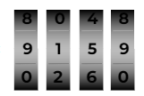

# Problème du cadenas 0000​

## Contexte

Soit un cadenas à combinaison de $N$ molettes ayant une combinaison initiale aléatoire et s'ouvrant si toutes les molettes sont à 0. ​
Chaque molette est composée de $D$ nombres (allant de 0 à $D-1$). ​

**Example molette $N$=4, $D$=10**



On considère que chaque molette ne peut se déplacer que d'un unique cran à chaque mouvement.​

Pour chaque mouvement :

1. Vous pouvez choisir un intervalle de molettes ($[g_i, d_i]$ avec $1 ≤ g_i ≤ d_i ≤ N$) pour effectuer un mouvement groupé ascendant ou descendant​.

2. L'intervalle de molettes du mouvement suivant doit contenir l'intervalle précédent. ($g_i ≤  g_{i-1}  ≤  d_{i-1}  ≤ d_i$)​.


​
**Exemple non-valide:**   Tourner l'intervalle [1,4] puis l'intervalle [6,9] ​

​
Déterminer la **quantité des mouvements ​nécessaire et minimale** pour ouvrir le cadenas.​

- Toutes les molettes dans l'intervalle se déplacent de la même manière (ascendant ou descendant). ​
- Si la molette est égale à D-1 et qu'un mouvement ascendant est réalisé, elle sera alors à 0, et inversement​
- Un intervalle de molettes n'est pas obligatoirement composé de molettes affichant un même nombre

## Séquence d'entrée/sortie

Vous allez tester votre programme avec un fichier texte contenant $T$ tests différents chaque test contient dans la premier ligne le numéro $N$ de chiffres dans le cadena et $D$ le numéro maximal que chaque chiffre peut attendre.​

- **Exemple fichier en entrée**

    ```
    2        ​
    6 2​
    1 1 0 1 0 1 ​
    6 2 ​
    0 1 0 1 1 1
    ```

- **Exemple fichier en sortie**

    ```
    Test 1: 3​
    Test 2: 2
    ```

**Note**
Exemple d'ouverture du prèmiere cas:

```
Pour le premier cas:​
1 1 0 1 0 1 ​
[4,4] en descendant​
1 1 0 0 0 1​
[3,5] en ascendant​
1 1 1 1 1 1​
[1,6] en descendant​
0 0 0 0 0 0
```

Nombre des pas 3.
